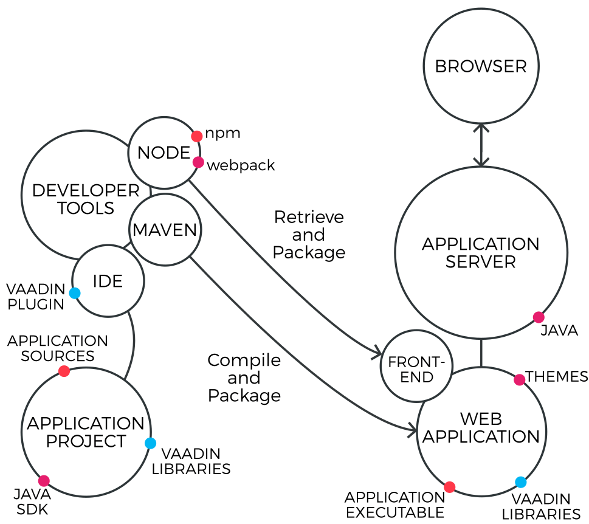

[[installing.toolchain]]
= A Reference Toolchain

This section presents a reference development environment.
Vaadin supports a wide variety of tools, so you can use any IDE for writing the code, almost any Java web server for deploying the application, most web browsers for using it, and any operating system platform supported by Java.

A recommended toolchain would be:

* Windows, Linux, or Mac OS X operating system
* link:http://www.oracle.com/technetwork/java/javase/downloads/index.html[Oracle Java SE 8] or later
* link:http://www.eclipse.org/downloads/[Eclipse IDE for Java EE Developers]
* link:http://tomcat.apache.org/[Apache Tomcat 9.0 (Core)]
* link:https://www.google.com/chrome/[Google Chrome] browser

The above reference toolchain is a good choice of tools, but you can use almost
any tools you are comfortable with.

We recommend using Java 8 or later for Vaadin development, but you need to make sure that your entire toolchain supports it.

[[figure.toolchain]]
.Development Toolchain and Process

<<figure.toolchain>> illustrates the development toolchain.
You develop your application as a Maven project using an IDE.
An IDE plugin can help in managing the project.
You compile and package the project using Maven.
The project must include, in addition to your source code, the Vaadin libraries.
It can also include project-specific themes.

You need to compile and deploy a project to a web container before you can use
it. You can deploy a project through the Web Tools Platform (WTP) for Eclipse
(included in the Eclipse EE package), which allows automatic deployment of web
applications from Eclipse. You can also deploy a project manually, by creating a
web application archive (WAR) and deploying it to the web container.
